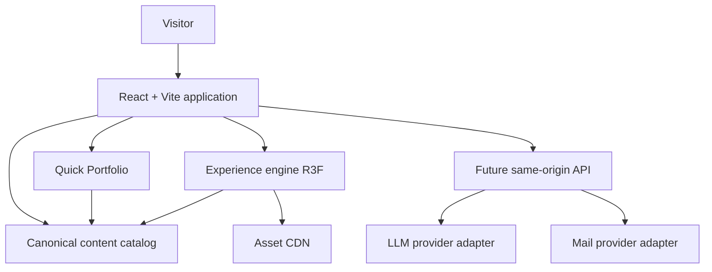

# Architecture

## Thesis

Digital Residence is a **static-first** web product with an **optional high-fidelity 3D experience**.

- The 3D world is an experience layer, never an information barrier.
- AI is an intelligence and navigation layer, never a single point of failure.
- Core professional information remains accessible as semantic HTML through Quick Portfolio and related routes.

## Locked stack

| Technology        | Responsibility                                  | Do not use it for                     |
| ----------------- | ----------------------------------------------- | ------------------------------------- |
| TypeScript        | Contracts and application code                  | Untyped escape hatches                |
| React + Vite      | Shell, routing, UI composition                  | Per-frame camera/pointer/shader state |
| Three.js / R3F    | 3D runtime                                      | Canonical business content            |
| Drei              | Scene helpers                                   | Unprofiled convenience                |
| GSAP              | Cinematic camera/room/light timelines           | Trivial 2D hovers                     |
| Motion            | 2D UI motion                                    | 3D cinematic sequencing               |
| Zustand           | Small cross-feature application state           | Hover, particles, camera transforms   |
| Tailwind + tokens | Layout and design language                      | Generic template aesthetics           |
| Zod               | Runtime validation of content and API contracts | Optional “trust the JSON” paths       |
| GLSL              | Signature effects only                          | Default materials                     |
| Blender           | Source art                                      | Publishing `.blend` files             |
| Python            | Optional asset tooling                          | A second runtime backend              |

## Logical topology

## Module boundaries

| Subsystem         | Code                           | Owns                                              |
| ----------------- | ------------------------------ | ------------------------------------------------- |
| Application shell | `src/app`                      | Bootstrap, routes, command dispatch, config       |
| Experience engine | `src/experience`, `src/scenes` | Camera director, quality, loading, scene registry |
| Navigation        | `src/navigation`               | Room graph, BFS, FSM                              |
| Content platform  | `src/content`                  | Schemas, seed, validation, selectors              |
| Events            | `src/events`                   | Typed bus, not source of truth                    |
| AI                | `src/ai`                       | Tool contracts, policy, command mapping           |
| API contracts     | `src/api`                      | Shared Zod contracts for a later small API        |
| Observability     | `src/observability`            | Telemetry abstraction and error taxonomy          |
| Security          | `src/security`                 | CSP, external links, env hygiene                  |

## Change control

Locked decisions change only through an ADR in `docs/adr/`. Convenience is not sufficient justification.
