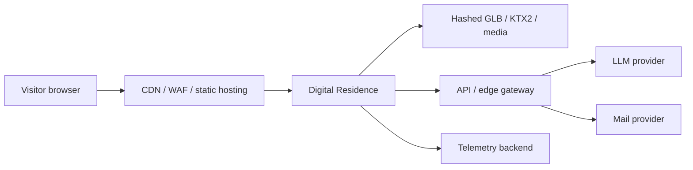

# System context

## Actors

- **Visitor** — untrusted. Receives static assets and public JSON. Never receives secrets.
- **Application shell** — trusted only as client code. Assume it can be modified.
- **Same-origin API** (future) — the only place provider credentials may exist.
- **Canonical catalog** — trusted content after Zod + relationship validation.

## Trust boundary

Browser → HTTPS → CDN/WAF → static app.

Dynamic calls, when introduced, stay on:

- `POST /api/v1/ai/chat`
- `POST /api/v1/contact`
- `POST /api/v1/analytics/events`
- `GET /api/v1/config/public`
- `GET /api/v1/health/*`

The frontend must not call OpenAI, Anthropic, SMTP, or analytics vendor SDKs directly.

## Runtime context that is allowed

Privacy-safe session context in memory: language, motion preference, coarse visitor type, current room. No durable invasive profile.
